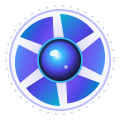

<a id="readme-top"></a>

<!-- PROJECT SHIELDS -->
[![Contributors][contributors-shield]][contributors-url]
[![Forks][forks-shield]][forks-url]
[![Stargazers][stars-shield]][stars-url]
[![Issues][issues-shield]][issues-url]
[![MIT License][license-shield]][license-url]

<!-- PROJECT LOGO -->
<br />
<div align="center">
  <a href="https://github.com/sibinsabu/iris-product-support-chatbot">
    
  </a>

  <h2 align="center">Iris — Precision Gadget Diagnostic &amp; Repair Copilot</h2>

  <p align="center">
    An intelligent, multi-modal AI repair advisor and customer support copilot for electronics (mobiles, laptops, earphones, audio gear, and wearables). Built with Azure OpenAI, Microsoft Foundry, Flask, and real-time repair guide crawling.
    <br />
    <a href="https://github.com/sibinsabu/iris-product-support-chatbot"><strong>Explore the docs »</strong></a>
    <br />
    <br />
    <a href="http://127.0.0.1:5000">View Local Demo</a>
    &middot;
    <a href="https://github.com/sibinsabu/iris-product-support-chatbot/issues/new?labels=bug">Report Bug</a>
    &middot;
    <a href="https://github.com/sibinsabu/iris-product-support-chatbot/issues/new?labels=enhancement">Request Feature</a>
  </p>
</div>

<!-- TABLE OF CONTENTS -->
<details>
  <summary>Table of Contents</summary>
  <ol>
    <li>
      <a href="#about-the-project">About The Project</a>
      <ul>
        <li><a href="#key-capabilities">Key Capabilities</a></li>
        <li><a href="#built-with">Built With</a></li>
      </ul>
    </li>
    <li>
      <a href="#getting-started">Getting Started</a>
      <ul>
        <li><a href="#prerequisites">Prerequisites</a></li>
        <li><a href="#installation--setup">Installation &amp; Setup</a></li>
        <li><a href="#environment-configuration">Environment Configuration</a></li>
      </ul>
    </li>
    <li><a href="#usage--workflows">Usage &amp; Workflows</a></li>
    <li><a href="#api-endpoints">API Endpoints</a></li>
    <li><a href="#roadmap">Roadmap</a></li>
    <li><a href="#contributing">Contributing</a></li>
    <li><a href="#top-contributors">Top Contributors</a></li>
    <li><a href="#license">License</a></li>
    <li><a href="#contact">Contact</a></li>
  </ol>
</details>

<!-- ABOUT THE PROJECT -->
## About The Project

**Iris** is a next-generation AI diagnostic and repair copilot engineered for certified electronics repair labs and device service centers. Iris combines generative language intelligence, multimodal vision inspection, real-time dataset scraping, and automated booking to simplify troubleshooting for customers and support technicians alike.

### Key Capabilities

* 💬 **Multi-Turn Hardware Diagnostics**: Retains conversation history across questions and quotes, offering seamless continuity without repetitive queries.
* 📷 **Computer Vision Damage Assessment**: Customers upload photos of defective devices (e.g. cracked screens, shattered rear glass, deformed ports) for instant make/model identification and turnaround estimates.
* 💰 **Transparent Pricing & Interactive Booking**: Quotes all repairs in Indian Rupees (₹ / INR) and attaches instant 1-click booking and checkout cards backed by a 90-day Iris store warranty.
* 🕷️ **Federated Repair Dataset Crawler**: Crawls live repair manuals and teardowns from iFixit and local repair databases to empower technicians with real-time disassembly steps.
* 🎙️ **Speech Transcription**: Voice dictation powered by Azure Cognitive Services Speech SDK.
* 🎨 **Visual Concept Generation**: Integrated FLUX-1.1-pro image generation via Microsoft Foundry for schematics and repair illustrations.
* 🔍 **Text Analysis & Sentiment**: Deep entity extraction, keyword analysis, and summary generation.

<p align="right">(<a href="#readme-top">back to top</a>)</p>

### Built With

* [![Python][Python-shield]][Python-url]
* [![Flask][Flask-shield]][Flask-url]
* [![Azure OpenAI][Azure-shield]][Azure-url]
* [![OpenAI][OpenAI-shield]][OpenAI-url]
* [![HTML5][HTML5-shield]][HTML5-url]
* [![CSS3][CSS3-shield]][CSS3-url]
* [![JavaScript][JS-shield]][JS-url]

<p align="right">(<a href="#readme-top">back to top</a>)</p>

<!-- GETTING STARTED -->
## Getting Started

Follow these steps to set up and run Iris locally on your machine.

### Prerequisites

* **Python 3.10+** (Tested on Python 3.13)
* **pip** (Python package manager)
* An active **Azure OpenAI** or **Microsoft Foundry** subscription with deployed models (e.g. `gpt-4o`, `gpt-4o-mini`, vision-capable models, and speech services).

### Installation & Setup

1. **Clone the repository**
   ```sh
   git clone https://github.com/sibinsabu/iris-product-support-chatbot.git
   cd iris-product-support-chatbot
   ```

2. **Create and activate a virtual environment**
   * **Windows (PowerShell / cmd):**
     ```powershell
     python -m venv .venv
     .\.venv\Scripts\activate
     ```
   * **Linux / macOS:**
     ```bash
     python3 -m venv .venv
     source .venv/bin/activate
     ```

3. **Install dependencies**
   ```sh
   pip install -r requirements.txt
   ```

4. **Configure environment variables**
   ```sh
   cp .env.example .env
   ```
   Edit `.env` and fill in your Azure OpenAI endpoints and API keys.

5. **Start the local development server**
   ```sh
   python app.py
   ```
   Open your browser and navigate to **`http://127.0.0.1:5000`**.

<p align="right">(<a href="#readme-top">back to top</a>)</p>

### Environment Configuration

Configure the following variables in your `.env` file:

| Variable | Description | Example |
| :--- | :--- | :--- |
| `AZURE_OPENAI_ENDPOINT` | Azure OpenAI resource endpoint (*do NOT append `/api/projects/...`*) | `https://your-resource.openai.azure.com` |
| `AZURE_OPENAI_API_KEY` | Primary or secondary Azure OpenAI API key | `abcdef0123456789...` |
| `TEXT_MODEL_DEPLOYMENT` | Deployment name for conversational text diagnosis | `gpt-4o` |
| `VISION_MODEL_DEPLOYMENT` | Vision-enabled model deployment name | `gpt-4o` |
| `IMAGE_MODEL_DEPLOYMENT` | FLUX-1.1-pro or image generation deployment name | `FLUX-1.1-pro` |
| `SPEECH_ENDPOINT` | Azure Speech service endpoint | `https://your-speech.cognitiveservices.azure.com` |
| `SPEECH_API_KEY` | Azure Speech service key | `your_speech_key` |
| `SPEECH_REGION` | Azure Speech resource region | `eastus` |
| `PORT` | Local server port (defaults to 5000) | `5000` |

<p align="right">(<a href="#readme-top">back to top</a>)</p>

<!-- USAGE EXAMPLES -->
## Usage & Workflows

### 1. Hardware Chat & Diagnostics
Ask Iris natural language questions regarding broken screens, liquid contact, battery degradation, or loud laptop fans.
```text
User: "How much does it cost to replace a shattered back glass on my iPhone 13 Pro?"
Iris: "We can replace your iPhone 13 Pro back glass using precision laser removal for ₹2,499. Turnaround is 45 minutes with a 90-day warranty."
```

### 2. Defect Photo Analysis
Attach or drag-and-drop a photo of your damaged gadget. Iris runs visual diagnostic inspection, outlines the extent of structural damage, recommends OEM replacement parts, and appends a 1-click booking card.

### 3. Repair Dataset & iFixit Crawler
Access `/crawl` to search federated repair guides, step-by-step disassembly instructions, difficulty ratings, and required tooling directly from iFixit's open repair database.

<p align="right">(<a href="#readme-top">back to top</a>)</p>

<!-- API ENDPOINTS -->
## API Endpoints

| Method | Endpoint | Description |
| :--- | :--- | :--- |
| `POST` | `/api/chat` | Multi-turn conversational diagnostics with context preservation |
| `POST` | `/api/vision` | Multimodal photo defect inspection & repair recommendation |
| `POST` | `/api/crawl` | Federated repair database & iFixit manual scraper |
| `GET` | `/api/crawl/guide/<id>` | Fetch detailed disassembly steps for a specific guide ID |
| `POST` | `/api/checkout` | Instant 1-click repair ticket booking & order confirmation |
| `POST` | `/api/warranty-check` | IMEI / Serial number warranty verification |
| `GET` | `/health` | Live diagnostic status of connected Azure AI endpoints |

<p align="right">(<a href="#readme-top">back to top</a>)</p>

<!-- ROADMAP -->
## Roadmap

- [x] Multi-turn conversational context retention across chat and vision
- [x] Computer vision defect detection for cracked screens & shattered glass
- [x] 1-Click Repair Ticket & Booking drawer with GST estimation
- [x] Federated crawler integration with iFixit guides
- [ ] WhatsApp / SMS booking notifications for repair status tracking
- [ ] Support for local language voice dictation (Hindi, Tamil, Malayalam)
- [ ] Direct parts inventory synchronization with local ERP

<p align="right">(<a href="#readme-top">back to top</a>)</p>

<!-- CONTRIBUTING -->
## Contributing

Contributions make the open-source community an incredible place to learn, inspire, and create. Any contributions you make are **greatly appreciated**.

1. Fork the Project
2. Create your Feature Branch (`git checkout -b feature/AmazingFeature`)
3. Commit your Changes (`git commit -m 'feat: Add some AmazingFeature'`)
4. Push to the Branch (`git push origin feature/AmazingFeature`)
5. Open a Pull Request

<p align="right">(<a href="#readme-top">back to top</a>)</p>

<!-- TOP CONTRIBUTORS -->
## Top Contributors

<a href="https://github.com/sibinsabu/iris-product-support-chatbot/graphs/contributors">
  
</a>

* **Sibin Sabu** ([@sibinsabu](https://github.com/sibinsabu)) — Creator & Lead Maintainer
* **Anto Sajo** ([@Antosajo045](https://github.com/Antosajo045)) — Contributor

<p align="right">(<a href="#readme-top">back to top</a>)</p>

<!-- LICENSE -->
## License

Distributed under the MIT License. See `LICENSE` for more information.

<p align="right">(<a href="#readme-top">back to top</a>)</p>

<!-- CONTACT -->
## Contact

* **Name**: Sibin Sabu
* **GitHub Username**: [@sibinsabu](https://github.com/sibinsabu)
* **GitHub Profile**: [https://github.com/sibinsabu](https://github.com/sibinsabu)
* **Project Link**: [https://github.com/sibinsabu/iris-product-support-chatbot](https://github.com/sibinsabu/iris-product-support-chatbot)

<p align="right">(<a href="#readme-top">back to top</a>)</p>

<!-- MARKDOWN LINKS & IMAGES -->
[contributors-shield]: https://img.shields.io/github/contributors/sibinsabu/iris-product-support-chatbot.svg?style=for-the-badge
[contributors-url]: https://github.com/sibinsabu/iris-product-support-chatbot/graphs/contributors
[forks-shield]: https://img.shields.io/github/forks/sibinsabu/iris-product-support-chatbot.svg?style=for-the-badge
[forks-url]: https://github.com/sibinsabu/iris-product-support-chatbot/network/members
[stars-shield]: https://img.shields.io/github/stars/sibinsabu/iris-product-support-chatbot.svg?style=for-the-badge
[stars-url]: https://github.com/sibinsabu/iris-product-support-chatbot/stargazers
[issues-shield]: https://img.shields.io/github/issues/sibinsabu/iris-product-support-chatbot.svg?style=for-the-badge
[issues-url]: https://github.com/sibinsabu/iris-product-support-chatbot/issues
[license-shield]: https://img.shields.io/github/license/sibinsabu/iris-product-support-chatbot.svg?style=for-the-badge
[license-url]: https://github.com/sibinsabu/iris-product-support-chatbot/blob/main/LICENSE
[Python-shield]: https://img.shields.io/badge/Python-3776AB?style=for-the-badge&logo=python&logoColor=white
[Python-url]: https://www.python.org/
[Flask-shield]: https://img.shields.io/badge/Flask-000000?style=for-the-badge&logo=flask&logoColor=white
[Flask-url]: https://flask.palletsprojects.com/
[Azure-shield]: https://img.shields.io/badge/Azure_OpenAI-0078D4?style=for-the-badge&logo=microsoft-azure&logoColor=white
[Azure-url]: https://azure.microsoft.com/products/ai-services/openai-service
[OpenAI-shield]: https://img.shields.io/badge/OpenAI-412991?style=for-the-badge&logo=openai&logoColor=white
[OpenAI-url]: https://openai.com/
[HTML5-shield]: https://img.shields.io/badge/HTML5-E34F26?style=for-the-badge&logo=html5&logoColor=white
[HTML5-url]: https://en.wikipedia.org/wiki/HTML5
[CSS3-shield]: https://img.shields.io/badge/CSS3-1572B6?style=for-the-badge&logo=css3&logoColor=white
[CSS3-url]: https://en.wikipedia.org/wiki/CSS
[JS-shield]: https://img.shields.io/badge/JavaScript-F7DF1E?style=for-the-badge&logo=javascript&logoColor=black
[JS-url]: https://developer.mozilla.org/en-US/docs/Web/JavaScript
